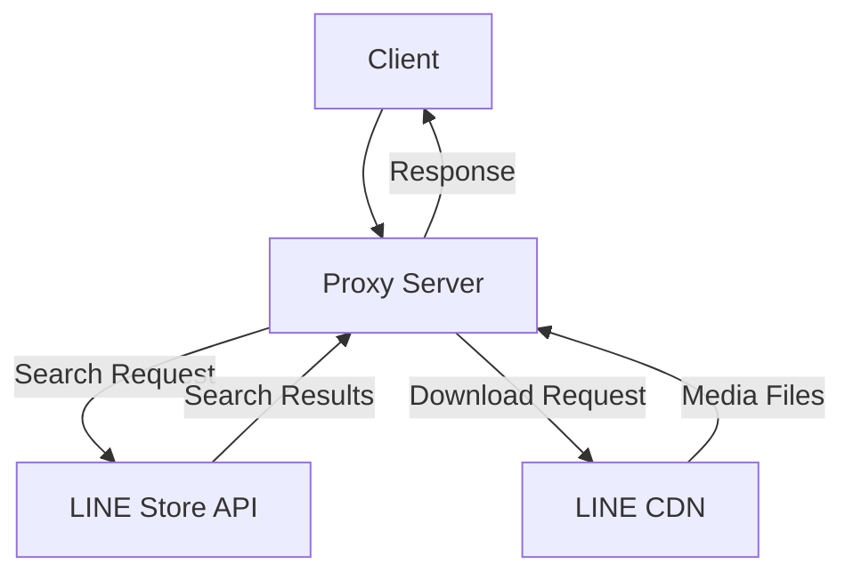

# line-stamp-api-proxy

Proxy server for LINE store API and CDN.

For educational and research purposes only.

[The demo server provided by Hugging Face🤗](https://daydreamer-json-line-stamp-api-proxy.hf.space/) is available.

## API Documentation

Please refer to [API.md](API.md).

## Technology Stack

- **Runtime**: Bun
- **Language**: TypeScript
- **Web Framework**: Hono
- **HTTP Client**: ky (Fetch API)
- **Logging**: log4js
- **Media encoding**: FFmpeg

## How it Works

This proxy server acts as an intermediary between clients and LINE's store API and CDN. When a client makes a request to this server, it forwards the request to LINE's servers using appropriate headers and user agents, then returns the response to the client. This allows access to LINE's sticker and emoji data without direct API access.

## Disclaimer

This project has no affiliation with LY Corporation (LINE ヤフー株式会社) and was created solely for private use, educational, and research purposes.

Please use it at your own risk.
